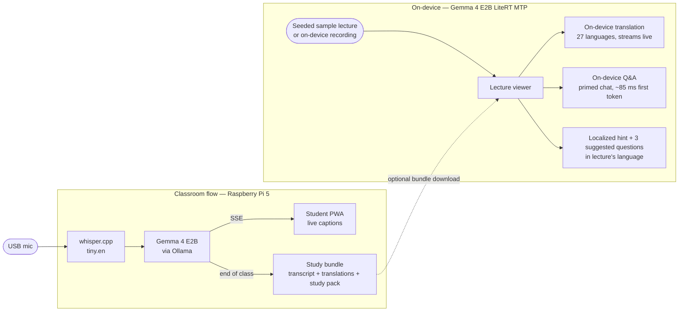

<p align="center">
  
</p>

> A $80 Raspberry Pi turns any classroom into a multilingual, offline AI learning hub.
>
> Submission to the [Gemma 4 Good Hackathon](https://kaggle.com/competitions/gemma-4-good-hackathon).

## What it does

1. Teacher speaks in English. The Pi captures audio.
2. Students scan a QR code, open a webpage on their phones, and pick their language.
3. Live captions stream in their own language as the teacher talks — Arabic, Ukrainian, Spanish, Mandarin, all at once.
4. End of class: a study bundle (transcript + translations + AI study pack) downloads to a companion iOS or Android app.
5. Student walks home, no internet on the bus, opens the app, and asks Gemma running **on their phone** any question about the lecture.

**Nothing leaves the room. No accounts. No cloud.**

## Architecture

EchoLang has two independent flows that both land in the same on-device
lecture viewer:

- **Classroom flow** — Pi captures audio, transcribes, translates live to
  many students, and packages an end-of-class study bundle that can
  optionally be downloaded to a phone.
- **Standalone flow** — phone alone. A seeded sample lecture (or one
  recorded on the device) feeds the viewer directly; translation, Q&A, and
  starters all run locally with no Pi anywhere.



Everything inside the **on-device** subgraph runs locally on the phone. The
standalone flow is the solid `builtin → lecture` edge — it never crosses
into the classroom subgraph, so it works with no Pi and no network.

## Repository layout

- `pi-server/` — FastAPI server that runs on the Raspberry Pi 5
- `pwa/` — Student-facing web app for live captions
- `mobile-app/` — Cross-platform Flutter app (iOS + Android) for offline lecture Q&A

## Hardware

- **Pi-side:** Raspberry Pi 5 (8 GB), USB microphone, WiFi
- **Student-side during class:** any device with a browser
- **Student-side after class:** iOS or Android phone with ~6 GB+ RAM (for on-device Gemma 4 E2B)

## Models

- [whisper.cpp](https://github.com/ggml-org/whisper.cpp) `tiny.en` for Pi transcription
- [Gemma 4 E2B](https://huggingface.co/google/gemma-4-E2B) on the Pi via [Ollama](https://ollama.com) (`ollama pull gemma4:e2b`)
- [Gemma 4 E2B](https://huggingface.co/google/gemma-4-E2B) `.litertlm` bundle on phones via [flutter_gemma](https://pub.dev/packages/flutter_gemma) / [MediaPipe LLM Inference](https://ai.google.dev/edge/mediapipe/solutions/genai/llm_inference) — MTP-enabled variant on iOS for ~2× faster decode

## On-device performance

Measured live on an iPhone running iOS 26 with the MTP-enabled Gemma 4 E2B
LiteRT bundle. Three Q&A trials over a fixed lecture transcript; each
streamed token counted directly (not estimated). Reproduce with:

```bash
cd mobile-app
flutter run --release --dart-define=AUTOBENCH=true -d <iphone-udid>
# then pull Documents/bench_results.json via xcrun devicectl
```

The default Q&A path **primes the chat with the lecture transcript once**
and reuses the session for every follow-up question, instead of forcing
Gemma to re-prefill the ~6000-char transcript on every turn. Same hardware,
same model — only the KV cache management differs:

| Path | First-token | Decode rate | Notes |
|---|---|---|---|
| Fresh chat per question (naive) | 403–447 ms | 43 tok/s | Re-prefills the transcript every time |
| **Primed chat, reused (default)** | **80–105 ms** | 42 tok/s | **~5× faster** time-to-first-token |

A short follow-up answer ("Why do leaves appear green?" → 9 tokens) now
streams to completion in **293 ms** end-to-end. Decode rate is unchanged
because the bottleneck is the same matmul throughput; the savings come
entirely from skipping redundant prefill on the lecture context.

All answers in both modes were factually correct and grounded in the
provided transcript context.

## Trying it yourself

The **standalone flow** is the fastest way to evaluate the project — no Pi
required, no network after install. The mobile app ships a seeded sample
lecture ("Intro to Cell Biology" and "The Singular Value Decomposition"),
so on first launch you can immediately translate, ask Gemma questions, and
take a generated quiz, entirely on-device.

### Mobile app — iOS

Requires macOS with Xcode 16+, a physical iPhone with ~6 GB+ RAM (iPhone 13
or newer is comfortable), and an Apple ID for free signing.

```bash
cd mobile-app
flutter pub get
cd ios && pod install && cd ..
open ios/Runner.xcworkspace
# In Xcode: select your iPhone, set the team to your Apple ID under
# Signing & Capabilities, then ⌘R. First launch downloads ~3 GB of Gemma 4
# weights from Hugging Face into the app's sandbox.
```

The MTP-enabled `.litertlm` is fetched at first launch from
`huggingface.co/metricspace/gemma4-E2B-it-litert-64k-mtp` — no token needed.

### Mobile app — Android

Requires Android Studio (or just the command-line tools + a JDK 17 + Android
SDK 34), a physical Android phone with ~6 GB+ RAM, and USB debugging
enabled.

```bash
cd mobile-app
flutter pub get
flutter build apk --release
# APK lands at build/app/outputs/flutter-apk/app-release.apk
adb install build/app/outputs/flutter-apk/app-release.apk
```

The Android build uses the same Gemma 4 E2B `.litertlm` URL. MediaPipe's
Android backend doesn't accelerate via MTP today, so first-token latency on
Android is comparable to the "fresh chat" baseline in the benchmark table
above; the primed-chat speedup still applies.

### Classroom flow — Raspberry Pi 5

Optional, only if you want to see the live-captions side. Requires a Pi 5
(8 GB), a USB mic, and ~10 GB free disk for whisper + Gemma weights.

```bash
git clone https://github.com/KookiesNKareem/EchoLang.git
cd EchoLang/pi-server
bash scripts/setup-pi.sh         # installs Ollama, pulls gemma4:e2b, downloads whisper
source .venv/bin/activate
uvicorn app.main:app --host 0.0.0.0 --port 8080
```

Then on any phone or laptop in the same WiFi, open `http://<pi-ip>:8080/`
to get the student PWA with live captions and the language picker.

## Status

In development for the 2026-05-18 deadline.
