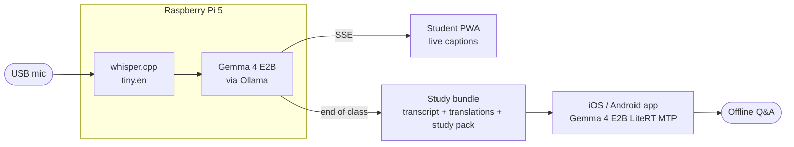

<p align="center">
  
</p>

> A $80 Raspberry Pi turns any classroom into a multilingual, offline AI learning hub.
>
> Submission to the [Gemma 4 Good Hackathon](https://kaggle.com/competitions/gemma-4-good-hackathon).

## What it does

1. Teacher speaks in English. The Pi captures audio.
2. Students scan a QR code, open a webpage on their phones, and pick their language.
3. Live captions stream in their own language as the teacher talks — Arabic, Ukrainian, Spanish, Mandarin, all at once.
4. End of class: a study bundle (transcript + translations + AI study pack) downloads to a companion iOS or Android app.
5. Student walks home, no internet on the bus, opens the app, and asks Gemma running **on their phone** any question about the lecture.

**Nothing leaves the room. No accounts. No cloud.**

## Architecture



## Repository layout

- `pi-server/` — FastAPI server that runs on the Raspberry Pi 5
- `pwa/` — Student-facing web app for live captions
- `mobile-app/` — Cross-platform Flutter app (iOS + Android) for offline lecture Q&A

## Hardware

- **Pi-side:** Raspberry Pi 5 (8 GB), USB microphone, WiFi
- **Student-side during class:** any device with a browser
- **Student-side after class:** iOS or Android phone with ~6 GB+ RAM (for on-device Gemma 4 E2B)

## Models

- [whisper.cpp](https://github.com/ggml-org/whisper.cpp) `tiny.en` for Pi transcription
- [Gemma 4 E2B](https://huggingface.co/google/gemma-4-E2B) on the Pi via [Ollama](https://ollama.com) (`ollama pull gemma4:e2b`)
- [Gemma 4 E2B](https://huggingface.co/google/gemma-4-E2B) `.litertlm` bundle on phones via [flutter_gemma](https://pub.dev/packages/flutter_gemma) / [MediaPipe LLM Inference](https://ai.google.dev/edge/mediapipe/solutions/genai/llm_inference) — MTP-enabled variant on iOS for ~2× faster decode

## On-device performance

Measured live on an iPhone running iOS 26 with the MTP-enabled Gemma 4 E2B
LiteRT bundle. Three Q&A trials over a fixed lecture transcript; each streamed
token is counted (not estimated). Reproduce with:

```bash
cd mobile-app
flutter run --release --dart-define=AUTOBENCH=true -d <iphone-udid>
# then pull Documents/bench_results.json via xcrun devicectl
```

| Workload | First-token | Total | Tokens | Decode rate |
|---|---|---|---|---|
| 1-sentence answer | 448 ms | 1.07 s | 25 | **40.0 tok/s** |
| Single-fact lookup | 465 ms | 0.69 s | 9 | 39.5 tok/s |
| Multi-clause explanation | 680 ms | 2.56 s | 52 | 27.6 tok/s |

A short answer streams in under 1.1 s end-to-end. All three answers were
factually correct and grounded in the provided transcript context.

## Status

In development for the 2026-05-18 deadline.
